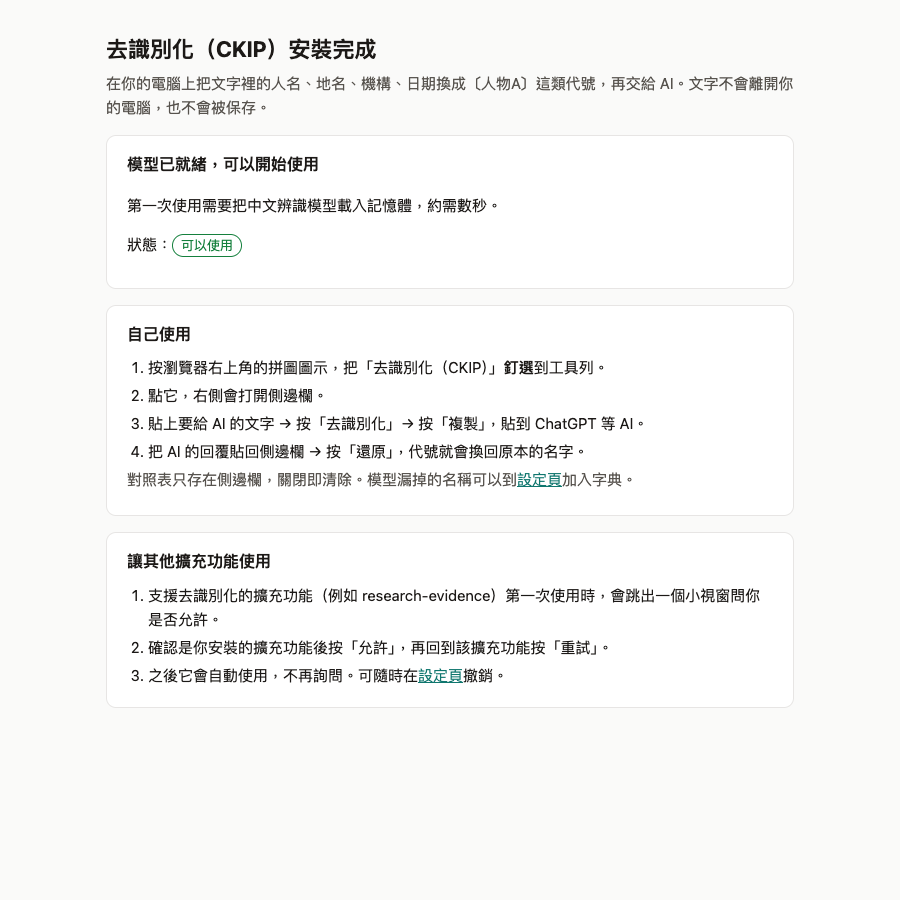
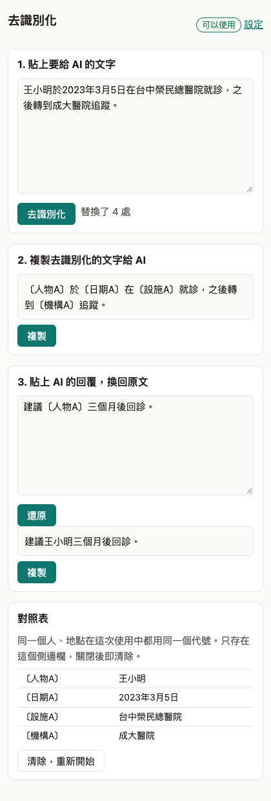
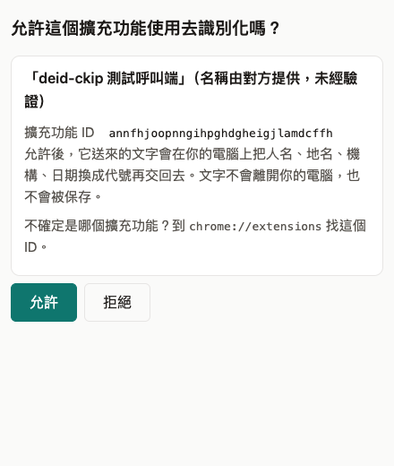
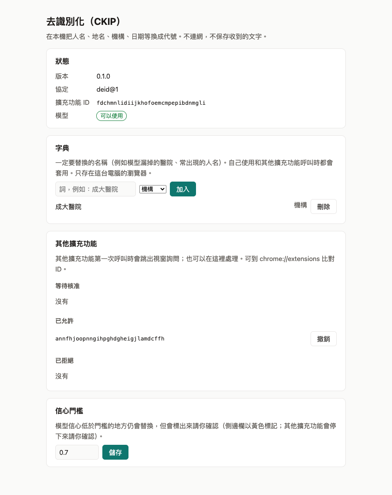

# deid-ckip

Chrome MV3「服務擴充功能」：在本機用 [CKIP](https://github.com/ckiplab/ckip-transformers) 中文 NER 模型＋使用者字典，把文字中的人名、地名、機構、日期等換成一致代號（例如 `〔人物A〕`）。其他擴充功能透過 **deid@1** 協定呼叫。

- 完全在本機執行：不連網（CSP `connect-src 'self'`），不保存收到的文字，也不保存對照表。
- 兩種用法：自己在側邊欄貼文字去識別化、再把 AI 回覆還原；或讓其他擴充功能呼叫（第一次會跳出視窗請你允許）。
- 擴充功能 ID：`fdchmnlidiijkhofoemcmpepibdnmgli`（由 `service.yaml` 的公鑰決定，未封裝載入也固定）。

完整規格與決策紀錄見 [SPEC.md](SPEC.md)。

## 安裝

1. 到 [Releases](https://github.com/yao-care/deid-ckip/releases/latest) 下載 `deid-ckip-<版本>.zip`（已含模型，約 19 MB），解壓縮到固定位置（之後不要刪除或移動）。
2. 在 Chrome 網址列輸入 `chrome://extensions`，打開右上角「開發人員模式」。
3. 按「載入未封裝項目」，選剛才解壓縮的資料夾。

上架 Chrome 線上應用程式商店後，改為在商店直接安裝（見 SPEC 11.4）。

## 使用流程

### 1. 安裝後：歡迎頁

安裝完成會自動開啟歡迎頁，說明用法並載入模型；看到「可以使用」即完成。請按瀏覽器右上角的拼圖圖示，把「去識別化（CKIP）」釘選到工具列。



### 2. 自己使用：側邊欄

點工具列上的圖示，右側會打開側邊欄。切換到 ChatGPT 等 AI 的分頁時，側邊欄會繼續開著。

1. 貼上要給 AI 的文字，按「去識別化」。
2. 按「複製」，貼到 AI。模型不確定的地方會以黃色標出，請確認一下。
3. 把 AI 的回覆貼回來，按「還原」，代號就會換回原本的名字。

同一個人在這次使用中都用同一個代號。對照表只存在側邊欄，關閉即清除。中途在設定頁改了字典時，已經出現過的詞會維持原本的代號（避免與先前貼給 AI 的內容對不上），側邊欄會提示；要全部套用新字典，請按「清除，重新開始」。



### 3. 讓其他擴充功能使用：核准視窗

支援 deid@1 的擴充功能（例如 research-evidence）第一次呼叫時，會跳出視窗詢問。確認是你安裝的擴充功能後按「允許」，再回到該擴充功能按「重試」；之後它會自動使用，不再詢問。按「拒絕」則之後不再詢問，可在設定頁取消。



### 4. 設定頁

在側邊欄點「設定」開啟，可以：

- **字典**：加入一定要替換的名稱（例如模型漏抓的醫院、常出現的人名），自己使用和其他擴充功能呼叫時都會套用。
- **其他擴充功能**：查看等待核准、已允許、已拒絕的擴充功能，可以允許、撤銷或取消拒絕。
- **信心門檻**：模型信心低於門檻的地方仍會替換，但會標出來請你確認。



## 給呼叫端開發者

```js
chrome.runtime.sendMessage('fdchmnlidiijkhofoemcmpepibdnmgli', { type: 'ping' }, (res) => {
  if (chrome.runtime.lastError) return /* 未安裝 */
  // res: { ok: true, protocol: 'deid@1', version: '0.1.0', ready: true, approved: true }
})
```

| 訊息 | 回覆 | 建議逾時 |
|---|---|---|
| `{ type: 'ping' }` | `{ ok, protocol, version, ready, approved }`；模型載入中或未核准時 `ready: false` | 3 秒 |
| `{ type: 'capabilities' }` | `{ entity_types, max_chars_per_request }` | 3 秒 |
| `{ type: 'deidentify', request_id, texts, entity_types, dictionary, existing_mapping, pseudonym_style }` | `{ request_id, texts, mapping, counts, low_confidence }` | 120 秒 |

錯誤回覆為 `{ error, code }`，`code` 可能是 `INVALID`、`TOO_LARGE`、`NOT_APPROVED`、`MODEL_NOT_READY`、`INTERNAL`。細節見 SPEC 第 3 節，範例見 [test/fixtures/contract/](test/fixtures/contract/)。

## 從原始碼建置（開發者）

需要 Node 22 以上、pnpm 10、Python 3.12（只在轉換模型時需要）。

```sh
pnpm install

# 一次性：下載 CKIP 模型並轉成 ONNX（產物在 models/，不進版控）
uv venv --python 3.12 .venv
uv pip install --python .venv/bin/python -r scripts/requirements.txt
.venv/bin/python scripts/convert-model.py

pnpm build
```

`pnpm build` 會核對 `models/` 的 sha256 與 `model-manifest.json` 一致，輸出 `dist/deid-ckip/` 與 `dist/deid-ckip-<版本>.zip`（即 Releases 上的檔案）。

`scripts/requirements.txt` 的版本針對 Intel Mac（torch 2.2.2 是最後支援的版本）；其他平台可用較新的 torch，但轉換後會與 PyTorch 比對標籤一致率，低於 0.97 就停止。

## 開發

| 指令 | 內容 |
|---|---|
| `pnpm test` | 單元、契約、隱私（不連網、不存原文）測試；有 `models/` 時另跑 tokenizer 與 HF 的逐 token 比對 |
| `pnpm test:model` | 加上實際模型推論（需要 `models/`，約 30 秒） |
| `pnpm typecheck` | TypeScript 型別檢查 |
| `pnpm e2e` | 在 Chromium 同時載入 `dist/deid-ckip` 與測試呼叫端（`test/e2e/caller/`），跑完整使用流程：安裝後歡迎頁、核准視窗、呼叫端去識別化、字典、側邊欄去識別化與還原（先 `pnpm build`，需 `pnpm exec playwright install chromium`）；加 `--shots` 會更新 `docs/screenshots/` |
| `pnpm e2e:sw` | Service Worker 存活實測：延遲 150 秒的測試建置跑一次 deidentify（約 4 分鐘） |
| `pnpm key` | 換金鑰時使用：由本機 `.keys/deid-ckip.pem` 算出公鑰與 ID，寫回 `service.yaml` |

私鑰 `.keys/deid-ckip.pem` 只在維護者本機，不進版控；一般建置不需要。

## 技術筆記

- **模型**：`ckiplab/albert-tiny-chinese-ner`，OntoNotes 18 類、BIES 標籤。以 fp32 ONNX 發布（約 16 MB）：int8 動態量化實測只有 88.5% 標籤與原模型一致。
- **執行**：offscreen 文件以 onnxruntime-web（wasm、單執行緒）推論；tokenizer 以 TypeScript 自行實作 BERT WordPiece 以取得字元位移，並以 HF `BertTokenizerFast` 的結果逐一比對（`test/fixtures/tokenizer-parity.json`）。
- **解碼**：512 token 滑動視窗（重疊 128），以限制轉移的 Viterbi 選出合法的 BIES 序列。逐 token 取最大值會出現「B B B E」「B-FAC I-ORG E-FAC」這類不合法組合。實體分數是路徑上各 token 機率的最小值，低於門檻（預設 0.7）列入 `low_confidence`。
- **速度**：在 Intel i9 的 Node 上，20000 字約 25 秒。
- **Service Worker 存活**：Chrome 文件寫明「收到事件或呼叫擴充功能 API 會重置 30 秒閒置計時器」，單一請求上限 5 分鐘，但沒有寫明「等待 `sendResponse` 期間」是否算活動。`pnpm e2e:sw` 實測（Playwright 驅動的 Chromium，模型就緒後先閒置 40 秒，再送出延遲 150 秒的請求）在 150 秒後仍收到正確回覆。但 Playwright 以 CDP 連著瀏覽器，可能讓 Service Worker 比一般使用時更不容易被回收，所以仍加上保活：推論期間 offscreen 每 20 秒送訊息給 Service Worker（文件寫明 offscreen 送來的訊息會重置計時器）。

## 已知限制

- **跨段實體**：呼叫方依字數硬切段落，實體被切在兩段之間時，各段分別處理，不跨段合併（`test/deid.test.ts` 有記錄）。
- **模型漏抓**：NER 不會百分之百辨識。例如虛構樣本（`test/fixtures/samples/clinic-note.txt`）中的「高雄」「成大醫院」沒有被辨識；重要的名稱請加入字典。模型偶爾也會把非實體標成實體（例如「血壓十年」被標成 DATE），這類通常分數很低，會列入 `low_confidence` 讓使用者確認。
- **相對時間不替換**：「今天、上週、三個月、早上」這類說法無法指出特定個人，即使模型標成日期／時間也保留原樣；具體的日期與時刻（2023年3月5日、三月、上午十點）照常替換。
- **單字元名稱**：模型辨識出的單字元實體會在該位置替換，但不會在全文其他位置掃描同一個字（避免「林」誤中「森林」）。
- **已發表文獻**：論文作者、機構也會被替換（保守做法）。

## 授權

GPL-3.0（CKIP 模型為 GPL-3.0）。見 [LICENSE](LICENSE)。
